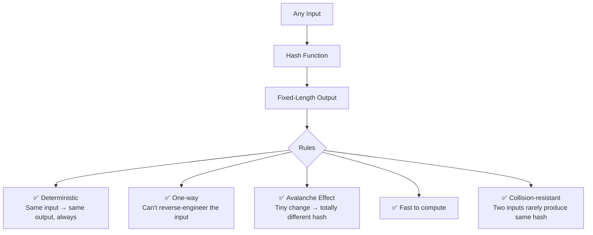
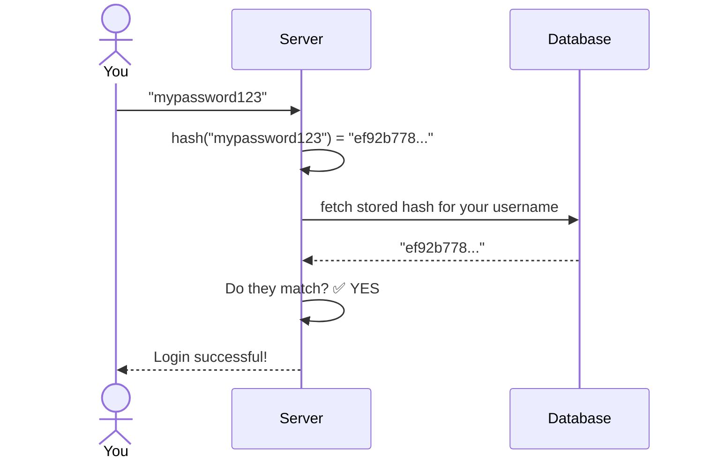

# Hashing — The Magic Fingerprint Machine

## The Core Idea

Imagine you have a **magic stamp machine**. You feed it *anything* — a word, a sentence, a whole book — and it spits out a **fixed-length code**. Always the same length. Always unique to that input. Feed it the same thing twice, you get the same code. Change even *one letter*, and the code is completely different.

That machine is a **hash function**. The code it spits out is called a **hash** (or digest).

```
"hello"   →  [ HASH MACHINE ]  →  2cf24dba5fb0a30e
"Hello"   →  [ HASH MACHINE ]  →  185f8db32921bd46   ← totally different!
"hello"   →  [ HASH MACHINE ]  →  2cf24dba5fb0a30e   ← always same result
```

---

## The Locker Room Analogy

Think of a gym with 1,000 lockers. Each locker has a **number on the door**.

When you arrive, the attendant doesn't randomly assign you a locker. Instead, he takes your **name**, runs it through a formula, and that formula *always* produces the same locker number for your name.

- "Raiyan" → locker #347
- "Ahmed" → locker #512
- "Raiyan" again next day → still locker #347

That formula is the hash function. Your locker number is the hash. You don't need to remember where your stuff is — the formula always points you to the right place. This is exactly how **hash tables** (like JavaScript objects `{}`) work under the hood.

---

## Key Properties — The "Rules" of a Hash



---

## Real-Life Situation: Storing Passwords

Here's where hashing becomes *critical*. Let's say you sign up on a website.

**The naive (dangerous) approach:**
```
You type:     "mypassword123"
DB stores:    "mypassword123"   ← 🚨 if hacked, everyone is exposed
```

**The hashing approach:**
```
You type:     "mypassword123"
Hash runs:    sha256("mypassword123")
DB stores:    "ef92b778bafe771..."   ← ✅ even devs can't read your password
```

When you log in next time:


The server **never stores your real password** — only its fingerprint. Even if the database is stolen, attackers just get a bunch of meaningless hashes.

---

## The Avalanche Effect — Why It's Powerful

This is the most mind-bending property. Change *one character*, and the hash explodes into something completely unrecognizable:

```
"cat"  →  77af778b51abd4a3...
"bat"  →  9e3669d19b675bd5...  ← nothing alike
"Cat"  →  38b60f5cce418b0d...  ← capital C, totally different
```

This is intentional. It means you can't "guess" the original input by studying the hash.

---

## Visualization Exercise 🧠

Close your eyes and picture this:

> You're standing in a huge factory. On one end, there's a **conveyor belt** where workers toss in raw materials — words, files, passwords. The belt carries them into a giant **black box machine** in the middle, covered in gears and lights. On the other side, small **printed tickets** pop out — same size every single time, no matter if you put in a single letter or an entire novel. Each ticket has a unique string of characters on it.
>
> Now picture yourself as a security guard at a website. A user comes to log in. You don't have their password — you threw the original away long ago. But you *do* have their **ticket** locked in a safe. When they type their password, you toss it into the machine, and check: *does the new ticket match the one in the safe?* If yes — they're in.

---

## Mental Model Summary

| Concept | Analogy |
|---|---|
| Hash function | The magic stamp machine / the locker formula |
| Hash output | The stamp / the locker number / the ticket |
| One-way property | You can't un-bake a cake |
| Avalanche effect | One wrong ingredient ruins the whole recipe |
| Password hashing | Storing a fingerprint instead of the actual key |
| Hash table lookup | Gym locker — formula tells you exactly where to go |

---

## Where You'll Use This as a Dev

- **Passwords** — never store plain text, always hash (bcrypt, argon2)
- **JavaScript objects & Maps** — hash tables power `{}` lookups behind the scenes
- **Git** — every commit has a hash (that 7-digit SHA you see)
- **File integrity** — check if a downloaded file was tampered with
- **Caching** — hash a request to use as a cache key

Hashing is one of those foundational ideas that quietly runs *everywhere* once you know to look for it.