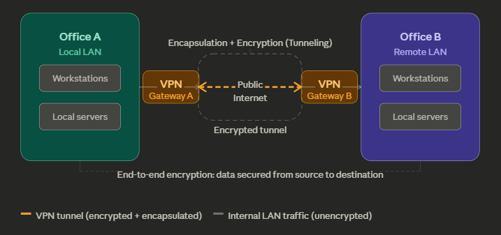

Here's a cleaned-up and expanded version of your WAN notes:

**Wide Area Network (WAN)**

A WAN is a network that connects multiple LANs (Local Area Networks) across large geographic distances — for example, linking a company's offices in different cities or countries.

**Why not just use the internet?**

Offices can already communicate over the public internet, so why bother with a WAN? The answer is security. The internet is a public network, which means your data travels through infrastructure shared with everyone — including attackers. A dedicated WAN gives organizations a private, controlled communication channel that isn't exposed to the general public.

**VPNs and Site-to-Site VPN**

One common and cost-effective way to build a WAN is by using VPNs (Virtual Private Networks) over the internet — specifically **site-to-site VPNs**, which connect two entire networks (e.g., Office A ↔ Office B) rather than individual devices.

Site-to-site VPNs work through two core mechanisms: encryption and encapsulation. Encryption scrambles the data so it's unreadable to outsiders. Encapsulation wraps the original network packet inside a new one, hiding its true source and destination. Together they form what's called a **tunnel** — a secure, private "pipe" through the public internet.

**Tunneling** is really just a special form of encapsulation. The data is wrapped, sent securely across the internet, and unwrapped at the other end — as if it traveled through a private cable.

**End-to-End Encryption**

Proper WAN security also involves **end-to-end encryption**, which ensures the data is encrypted from the source all the way to the final destination — not just at certain hops along the way. This prevents interception even if someone manages to access traffic in the middle of the route.

Here's a diagram showing how all of this fits together:A quick summary of the key concepts:

| Term | What it means |
|---|---|
| WAN | Network of connected LANs across cities/countries |
| Site-to-site VPN | Connects two whole office networks securely |
| Encryption | Scrambles data so outsiders can't read it |
| Encapsulation | Wraps packets to hide origin/destination |
| Tunneling | Special encapsulation — creates a private "pipe" through the internet |
| End-to-end encryption | Data stays encrypted from sender to final receiver, not just at certain hops |