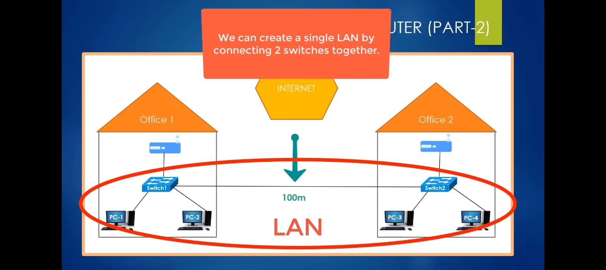
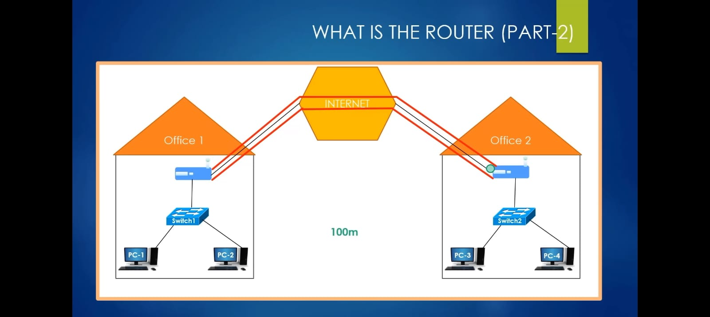

# Connecting Multiple Office Networks

## Scenario: Two Offices, Short Distance

Consider two office buildings separated by only **100 meters**. At this distance, it's practical to extend a single **Local Area Network (LAN)** by connecting the two switches with an Ethernet cable (Cat5e/Cat6 supports up to 100m per segment). This gives both offices shared access to the same network with no routing required.

> **Note:** If the distance exceeds 100 meters, a standard Ethernet cable run won't work reliably without repeaters or fiber — so this approach only applies to short, physically close locations.

When multiple buildings on the same campus or site are connected this way, it is often referred to as a **Campus Area Network (CAN)** — a network that spans multiple buildings within a localized geographic area.

---

## Scenario: Two Offices, Long Distance

When offices are far apart (e.g., different cities or countries), a physical cable isn't feasible. Instead, organizations connect remote offices over a **Wide Area Network (WAN)** — typically using one of two approaches:

### 1. Private WAN (Leased Line / MPLS)
A **dedicated private line** is provisioned directly between two locations by a telecom provider. Traffic never crosses the public internet.

- ✅ High reliability and performance
- ✅ Traffic stays completely off the public internet
- ❌ Extremely expensive, especially over long distances (imagine the cost of a **500 km dedicated line**)

### 2. VPN Tunneling over the Public Internet
A **VPN (Virtual Private Network)** creates an encrypted tunnel between two sites over the public internet. The most common protocol for this is **IPsec** or **SSL/TLS**.

- ✅ Much cheaper than a leased line
- ✅ Easy to deploy anywhere with internet access
- ❌ Traffic passes through the public internet (encrypted, but still exposed to potential interception or DDoS)

---

## Which Is More Secure?

| Method | Traffic Path | Security Level |
|---|---|---|
| Direct LAN (cable) | Stays on private wire | ✅ Most secure |
| Private WAN (leased line) | Stays on private infrastructure | ✅ Very secure |
| VPN over Internet | Encrypted, but crosses public internet | ⚠️ Secure, but higher exposure |

**Bottom line:** A direct cable LAN is the most secure because packets never leave your private physical medium. VPN tunneling is reasonably secure due to encryption, but the traffic still traverses shared public infrastructure — making it inherently more exposed than a fully private connection.

---

## Key Devices: Switches vs. Routers

| Device | Used For | Scope |
|---|---|---|
| **Switch** | Building a LAN | Connects devices *within* the same network |
| **Router** | Building/connecting a WAN | Connects *different* networks together |

### Switches (LAN)
A switch operates at **Layer 2 (Data Link)** of the OSI model. It forwards traffic based on **MAC addresses** within a single network. You cannot use a traditional switch to connect two separate networks — it has no concept of IP routing.

### Routers (WAN)
A router operates at **Layer 3 (Network)** of the OSI model. Its primary job is to **route packets between different networks** based on **IP addresses**. The physical location of those networks doesn't matter — a router can connect your office LAN to a branch office across the country, or to the internet.

> **Summary:** Use switches to build a LAN. Use routers to connect networks and build a WAN.