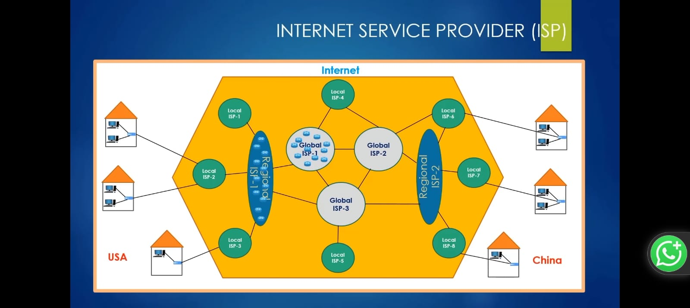

# Internet Service Provider (ISP)

In the previous section, we saw that there are a lot of routers on the internet.

As you can see in the image above, the internet consists of a large number of routers spread across different areas.

We can think of ISPs as a mechanism that controls all the routers within a given area. Each ISP is responsible for managing certain routers in its region, as shown in the image above.

**ISPs (Internet Service Providers)** are companies that enable us to connect to the internet, typically for a fee. The ISP is responsible for the transmission of packets from one location to another.

---

## Local ISP

Local ISPs are responsible for small-area communication — for example, connecting a neighborhood.

---

## Points of Presence (POP)

A **Point of Presence (POP)** is a physical location that contains networking equipment such as routers, switches, servers, and so on.

All of the router icons in the diagram above actually represent POPs.

---

## Local ISPs & Regional ISPs

- **Local ISPs** connect neighborhoods.
- **Regional ISPs** connect cities within a country.

---

## Global ISPs

What if countries want to communicate with each other? That's where **Global ISPs** come in. Global ISPs form the backbone of international internet communication, linking regional networks across the world.